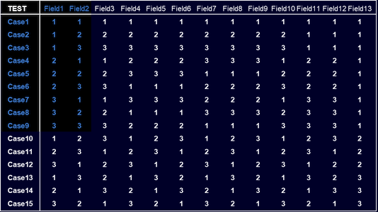
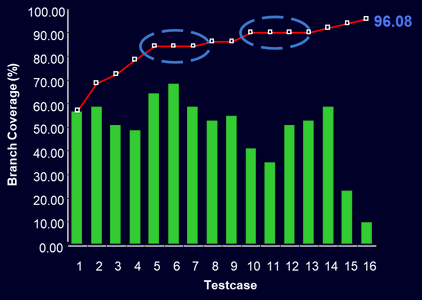

HELP! My Test Suite is too BIG for my PABOT!
============================================

## Or: How to have fun with too many tests!

This presentation gives examples of some problems and possible solutions.

Every so often someone in [Slack](https://robotframework.slack.com/) or the [Forum](http://forum.robotframework.org/) asks how to run extremely large test suites in parallel using [Pabot] (a parallel test runner for RF). This demo will demonstrate problems we have run into and solutions using [Pabot] and the [DataDriver] (extension to RF to run data driven tests from data files).

The demo is not intended to complain about [Pabot] or the [DataDriver], but to mention some of the challenges with large test suites, and hopefully inspire people to create even better tests using these tools!

At the end of these notes, several other techniques to reduce the number of test cases while increasing test effectiveness will be mentioned.

### Intro...

   #### Challenge

   * It can be easy to have a combinatorial explosion of possible tests, *especially* when filling out forms
   * Some projects also have requirements where they must prove that everything works exactly as promised.
   * However, you can use scripts or other tools to automatically generate data driven testcases!
   * Robot Framework's [DataDriver] makes it easy to run these tests and 
   * [Pabot] makes it easy to run tests in parallel reducing the execution time
   * Nonetheless, a combinatorial explosion may have thousands and thousands of tests and there are limits to space-time, like the life time of the universe, that get in the way This demo will discuss some of things I have used solve this


   #### Our Problem

   * This demo has code examples inspired by issues we had in a project while trying to test software for importing lots of different products from all the different countries.
   * You can imagine all the thousands of combinations of products, countries, treaties and comsumer protection laws that must be taken into consideration.
   * The rules for countries can regularily change depending on changing safety concerns and political spats - and there can't be mistakes because some products will not last if tied up at borders for long.

   This demo is not long enough to go into very much depth, but I hope it will give you some ideas you can research further to solve your specific problems. There will also be links in these notes to help
   
### 1. [DataDriver], [Pabot] and [PICT]

#### Sample Data

   * Instead of using our project data, we will use a standard example for Microsoft's [PICT] test case generation tool will be used instead, and because its model: 
   [data/pict_arg.pict](data/pict_arg.pict) 
   is easier to understand the relationships than looking at all the combinations in the CSV file: 
   [data/3360_tests.csv](data/3360_tests.csv)
   * These values are different ways of configuring a hard drive in windows. Many of these combinations are not valid and could have been removed with rules. However the actual data is not really important to the demo, so the rules were left out for simplicity.
   * [PICT] was used specifically because it is easy to generate test data with, and the [DataDriver] can call it directly. However, the generated CSV files will still be used in the examples because that is what people are most accustomed to using.
   * There are 3360 exhaustive testcases, but typically smaller sub-sets will be used.


#### [DataDriver]

   * Taking a look at the test case code itself: 
   [`tests/demonstration/csv_data_driver.robot`](tests/demonstration/csv_data_driver.robot), 
   adding the data driver is pretty simple: 

   * Some changes have been made to the [DataDriver]'s original [example](https://github.com/Snooz82/robotframework-datadriver/blob/main/atest/TestCases/Defaults/PICT/pict_arguments.robot
   ) testcase. For example:
        ```robotframework
        *** Settings ***
        Library     DataDriver   file=${TESTFILE}   encoding=utf-16   dialect=excel-tab
        ```
     * `${TESTFILE}` allows you to pass the test file name as a variable from the command line.
     * `encoding=utf-16` is necessary because the text data files were created in Windows, which has a different format than what Python or Linux would typically use. This has messed us up lots of times. 
     * `dialect=excel-tab` The format of text Excel file is one with tab separated CSV files - just because they're nicer to look at rather than everything stuck together with just commas between fields.

   * The [DataDriver] needs one example data driven test case, using the standard robot [data-driven test case style]. 
   When robot runs the test suite the data driver will replace it with the ones it generates.
        ```robotframework
        *** Test Cases ***
        Combination:__${Type}__${Size}__${Format method}__${File system}__${Cluster size}__${Compression}
        ...    NODATA   NODATA   NODATA   NODATA   NODATA   NODATA
        ```
     * ***NOTE***: if you are filtering your test cases, with tags in the data driver file if the, if sample test case is not filtered in, then the data driver will never get called, and the tagged test cases will never be generated. 
     * Notice also, we do not use real test data in the sample, because if something went wrong with the datafile, it would appear as if only one test case executed. Using descriptive invalid data is much more obvious. 
     * The [DataDriver] will also automatically create testcase names for you, and we purposely created really long names in order to tell the test cases apart. Unfortunately, some of these names grew to be 30 or 40 characters long ...and that caused problems. 
  
  * Then the template keyword, like in the regular [data-driven test case style], is passed all the parameters.
    ```robotframework
    *** Keywords ***
    Check Variables
        [Arguments]   ${Type}   ${Size}   ${Format method}   ${File system}    ${Cluster size}    ${Compression}
        Pass Execution   OK
    ```
     * For this demo the test code was removed keyword because it was not necessary

  * To run the test:
    ```shell
    robot --outputdir results --variable TESTFILE:data\56_tests.csv --suite csv_data_driver .
    ```
     * `--outputdir` is there simply so output files do not clutter up the folder. 
     * `--variable TESTFILE:data\56_tests.csv` is the test case name variable mentioned earlier, so different data files can be passed to the test suite. 
     * `--suite csv_data_driver .` and this will search for the test suite starting from the current folder.

     <br>Everything passes:
     ```
       [... lines omitted...]

     ==============================================================================
     RBCN 2025 Big Test Demo                                               | PASS |
     56 tests, 56 passed, 0 failed
     ==============================================================================
     ``` 

#### [Pabot]

* To run test cases in parallel with [Pabot], just means replacing the `robot` command with `pabot` and adding pabot's options
   * In addition, the robot options were replaced with the corresponding single letter options (e.g. `--outputdir` = `-d`) to make the pabot options obvious
   * And, a 1 sec delay was added to the template, to show the performance improvement from parallelism.  The whole test suite now takes about one minute to run

       ```shell
       pabot --verbose --processes 10 --testlevelsplit -d results -v TESTFILE:data\56_tests.csv -s sleepy_data_driver .
       ```
   * `--testlevelsplit` is needed so *test cases* are run in parallel, instead of *test suites*.
   * `--processes 10` will run the test cases in 10 parallel processes.<br>
   ***NOTE:** Our work computers could only run (at most) 5 of our tests in parallel*
       ```
          [... lines omitted...]

       56 tests, 56 passed, 0 failed, 0 skipped.
       ===================================================
          [... lines omitted...]
       Total testing: 1 minute 9.50 seconds
       Elapsed time:  10.47 seconds
       ```
    * [Pabot] cannot finish until the last process finishes (with 6 test cases) and there is extra overhead, but 11 seconds is still much faster than 70 seconds for the whole suite!


## 2. Problem: "The command line is too long"?
* However, our build servers could only handle 2 of our test cases in parallel.
* What if we also increase the number of testcases slightly tp 281?:
    ```shell
    pabot --verbose --processes 2 --testlevelsplit -d results -v TESTFILE:data\281_tests.csv -s csv_data_driver .
    ```
    Result:
    ```
       [...]
    The command line is too long.

    WARN: No output files in "results\pabot_results"
    0 tests, 0 passed, 0 failed, 0 skipped.
    ===================================================
    Output:
    [ ERROR ] Reading XML source '' failed: No such file or directory
    
    Try --help for usage information.
    Stopping PabotLib process
    Robot Framework remote server at 127.0.0.1:8270 stopped.
    PabotLib process stopped
    Total testing: 1.30 seconds
    Elapsed time:  2.91 seconds
    ```
   <p style="color:yellow">ヽ(°o°)ﾉ !?!</p>
   <br>

    Looking at the logs, each of the processes is executed with a command like this:

    ```
    [...][PID:13304] [0] [ID:2] EXECUTING PARALLEL RBCN 2025 Big Test Demo.Tests.Demonstration.Csv Data Driver with command:robot --suite "RBCN 2025 Big Test Demo.Tests.Demonstration.Csv Data Driver" --variable "TESTFILE:data\281_tests.csv" --variable "DYNAMICTESTS:RBCN 2025 Big Test Demo.Tests.Demonstration.Csv Data Driver.Combination:__Mirror__10__Quick__FAT32__1024__On|RBCN 2025 Big Test Demo.Tests.Demonstration.Csv Data Driver.Combination:__Single__500__Slow__FAT__2048__Off|RBCN 2025 Big Test Demo.Tests.Demonstration.Csv Data Driver.Combination:__Stripe__40000__Slow__NTFS__512__On|RBCN 2025 Big Test Demo.Tests.Demonstration.Csv Data Driver.Combination:__RAID-5__10__Quick__NTFS__512__Off|RBCN 2025 Big Test Demo.Tests.Demonstration.Csv Data Driver.Combination:__Stripe__500__Quick__FAT__4096__On|RBCN 2025 Big Test Demo.Tests.Demonstration.Csv Data Driver.Combination:__RAID-5__10__Slow__FAT32__4096__On|RBCN 2025 Big Test Demo.Tests.Demonstration.Csv Data Driver.Combination:__Stripe__100__Quick__FAT32__4096__Off|RBCN 2025 Big Test Demo.Tests.Demonstration.Csv Data Driver.Combination:__Span__100__Slow__FAT__65536__On|RBCN 2025 Big Test Demo.Tests.Demonstration.Csv Data Driver.Combination:__Stripe__40000__Quick__FAT__32768__Off|
       [... dozens of arguments omitted ...]
   |RBCN 2025 Big Test Demo.Tests.Demonstration.Csv Data Driver.Combination:__Span__10__Quick__FAT__2048__Off|RBCN 2025 Big Test Demo.Tests.Demonstration.Csv Data Driver.Combination:__Single__5000__Quick__FAT__4096__Off|RBCN 2025 Big Test Demo.Tests.Demonstration.Csv Data Driver.Combination:__Span__10__Slow__NTFS__512__Off|RBCN 2025 Big Test Demo.Tests.Demonstration.Csv Data Driver.Combination:__Stripe__100__Slow__NTFS__65536__On|RBCN 2025 Big Test Demo.Tests.Demonstration.Csv Data Driver.Combination:__Span__1000__Quick__FAT__32768__Off|RBCN 2025 Big Test Demo.Tests.Demonstration.Csv Data Driver.Combination:__Mirror__40000__Quick__FAT__512__On" --variable CALLER_ID:e02ed1681a0345aca64b5ff6c848a9ad --variable PABOTLIBURI:127.0.0.1:8270 --variable PABOTEXECUTIONPOOLID:0 --variable PABOTISLASTEXECUTIONINPOOL:0 --variable PABOTNUMBEROFPROCESSES:2 [...]
    ```

* The [DataDriver] and [Pabot] use the command line to tell Robot which test cases to run, and Windows only supports a maximum [8191 characters on the comand line](https://learn.microsoft.com/en-us/troubleshoot/windows-client/shell-experience/command-line-string-limitation#more-information). 
* You could create a custom [DataDriver] which passes the testcases to [Pabot] using a different mechanism (even while tests are running), but these are not documented and we will limit ourselves to what can be done in Robot code

## 3. Reduce size with...
### 1. Increase number of processes:

   ```shell
   pabot --processes 5 --testlevelsplit -d results -v TESTFILE:data\281_tests.csv -s csv_data_driver .
   ```
   works!

   * BUT we wanted to run thousands of testcases, AND even with 20 processes (which our computers could not use) this fails with the "command line is too long" error:
        ```shell
        pabot --processes 20 --testlevelsplit -d results -v TESTFILE:data\3360_tests.csv -s csv_data_driver .
        ```

### 2. Shorten suite name:
   * Run robot file directly so no suite hierarchy.
     * Switching from:
        ```shell
        pabot --verbose --processes 2 --testlevelsplit -d results -v TESTFILE:data\281_tests.csv -s csv_data_driver .
        ```
        To:
        ```shell
        pabot --verbose --processes 2 --testlevelsplit -d results -v TESTFILE:data\281_lines.csv .\tests\demonstration\lines.robot
        ```
      * Will reduce `RBCN 2025 Big Test Demo.Tests.Demonstration.Csv Data Driver.Combination:__Mirror__10__Quick__FAT32__1024__On`<br> 
      to `Data.Combination:__Stripe__500__Slow__NTFS__65536__On`
      * BUT not good enough, and not great if you have many robot suites to run.

### 2. Shorten test name:
   * Move the descrptive test name to automatically generated test documentation (see [lines.robot](tests/demonstration/lines.robot))
     * AND add line numbers (see the [281_lines.csv](data/281_lines.csv) data file vs. [281_tests.csv](data/281_tests.csv))
     * Reduces test names from: `RBCN 2025 Big Test Demo.Tests.Demonstration.Csv Data Driver.Combination:__Mirror__10__Quick__FAT32__1024__On`<br>
       to: `Lines.T1`

        ```shell
        pabot --verbose --processes 2 --testlevelsplit -d results -v TESTFILE:data\281_tests.csv .\tests\demonstration\data.robot
        ```
        Works!:
        ```
           [...]
        281 tests, 281 passed, 0 failed, 0 skipped.
        ===================================================
           [...]
        Total testing: 3.30 seconds
        Elapsed time:  4.17 seconds
        ```
     * BUT running the full 3360 tests on our maximum 5 processes:

        ```shell
        pabot --processes 5 --testlevelsplit -d results -v TESTFILE:data\3360_lines.csv .\tests\demonstration\lines.robot
        ```
       **still fails!** Only 1 of the 5 processes managed to run...
        ```
        The command line is too long.
           [...]
        672 tests, 672 passed, 0 failed, 0 skipped.
        ===================================================
           [...]
        Total testing: 5.20 seconds
        Elapsed time:  7.21 seconds
        ```

## 4. Increase processes by running on more machines!
   If you cannot run enough processes on one machine to make the suite
   run, then you can break the test suite accross multiple machines!

### a. Break data into smaller files manually
   That can be a pain and takes away the advantage of using models to
   easily regenerate TCs when requirements change, or simply to further optomize
   the number of test cases. 
   
### b. [Pabot] has `--shard [SHARD]/[SHARD COUNT]` to break up test suites

   Fortunately, Pabot has the 
   [shard option](https://github.com/mkorpela/pabot?tab=readme-ov-file#command-line-options)
   to take care of this for you, that does not require any changes to the test 
   code; just another option on the command line (*going back again to just 
   56 test cases and passing the suite name instead of the robot file name*)

   ```shell
    pabot --processes 2 --testlevelsplit --shard 1/5 -d results -v TESTFILE:data\56_tests.csv  -s csv_data_driver .
   ```
   but

   ```
   Robot Framework remote server at 127.0.0.1:8270 started.
   Storing .pabotsuitenames file
   Not enought items (1) for shard cound (5).
   Stopping PabotLib process
   Robot Framework remote server at 127.0.0.1:8270 stopped.
   PabotLib process stopped
   Total testing: 0.0 seconds
   Elapsed time:  2.20 seconds
   ```

   [Pabot] fails because it cannot break 1 testcase into 5 shards. This is
   because the [DataDriver] does not generate the full suite until after [Pabot]
   calculates the shards, and so Pabot only sees the initial sample test case.


### c. Use a "[Pre-run Modifier]" which selects only every Xth test for execution

   The code: [csv_data_driver.robot](tests/demonstration/csv_data_driver.robot)
   is based on an example from the User Guide:
   https://robotframework.org/robotframework/latest/RobotFrameworkUserGuide.html#example-select-every-xth-test
   <br>(Please look there for a proper explanation of how it works.)

   Again running this only requires a change to the command line, and you now need to pass values for which slice (i.e.shard) out of the total number of slices you are running appended to the Python file's name. 
   ```shell
   pabot --processes 2 --testlevelsplit --prerunmodifier .\tests\demonstration\SelectEveryXthTest.py:5:0 -d results -v TESTFILE:data\56_tests.csv  -s csv_data_driver .
   ```
   But again it doesn't work:
   ```
      [...]
   56 tests, 56 passed, 0 failed, 0 skipped.
   ===================================================
      [...]
   Total testing: 2.90 seconds
   Elapsed time:  4.12 seconds
   ```
   All the testcases ran this time, but there should have only been 11 - one fifth of the test suite.

   Like before, the Pre-run modifier ran before the [DataDriver] had generated the test suite.

   **Note:** Using a [Listener] instead of a [Pre-run modifier] might work becuase 
   it runs once the test suite is being executed. There may even be other ways 
   to use a Pre-run modifier - but these are complex and I did not have a 
   chance to try them out.

[Listener]: https://robotframework.org/robotframework/latest/RobotFrameworkUserGuide.html#listener-interface
[Pre-run modifier]: https://robotframework.org/robotframework/latest/RobotFrameworkUserGuide.html#programmatic-modification-of-test-data


### d. Use a Config_Keyword: 

The techniques above still work great with regular test cases, but fortunately 
the [DataDriver] provides additional solutions:

A Config keyword allows you to programically change (or create) the Data Driver's
configuration - but you can also use it to generate a subset of the full
test suite for each machine you run the tests on!
[https://github.com/Snooz82/robotframework-datadriver?tab=readme-ov-file#configure-datadriver-by-pre-run-keyword](https://github.com/Snooz82/robotframework-datadriver?tab=readme-ov-file#configure-datadriver-by-pre-run-keyword)

This requires changes to your robot file: 
[config_keyword.robot](tests/demonstration/config_keyword.robot)

And you need to pass values for which slice out of the total number of slices you are 
running as variables. 

```shell
pabot --processes 2 --testlevelsplit -d results -v SLICE:5 -v NUM_SLICES:5 -v TESTFILE:data\56_tests.csv  -s config_keyword .
```

Finally, just **one fifth** of the test cases were executed! 
```
   [...]
11 tests, 11 passed, 0 failed, 0 skipped.
===================================================
   [...]
Total testing: 2.70 seconds
Elapsed time:  4.11 seconds
```


### e. Or a Custom Reader: 
I was going to avoid creating a custom file reader in Python, but in this case it
turned out to be fairly simplistic
[https://github.com/Snooz82/robotframework-datadriver?tab=readme-ov-file#custom-datareader-classes](https://github.com/Snooz82/robotframework-datadriver?tab=readme-ov-file#custom-datareader-classes)

The reason the code is simple is because it is not really a custom reader, but 
["over loading"](https://en.wikipedia.org/wiki/Function_overloading) the existing
CSV reader: 
[my_slice_reader.py](tests/demonstration/my_slice_reader.py)

Again the Robot file needs to be changed, but only the configuration of the 
[DataDriver] library in:
[custom_reader.robot](tests/demonstration/ccustom_reader.robot)

```shell
pabot --processes 2 --testlevelsplit -d results -v SLICE:5 -v NUM_SLICES:5 -v TESTFILE:data\56_tests.csv  -s custom_reader .
```
```
   [...]
11 tests, 11 passed, 0 failed, 0 skipped.
===================================================
   [...]
Total testing: 2.70 seconds
Elapsed time:  4.5 seconds
```

And most importantly, 3360 tests with 6 slices:
```
pabot --processes 5 --testlevelsplit -d results -v SLICE:1 -v NUM_SLICES:6 -v TESTFILE:data\3360_lines.csv  -s custom_lines .
```
Works!
```
   [...]
560 tests, 560 passed, 0 failed, 0 skipped.
===================================================
   [...]
Total testing: 10.90 seconds
Elapsed time:  6.40 seconds
```

## 5. This may still not be enough. 

You may not have "6" test servers to spread the load over, or it may just take
far too long for all test suite to run!

But do you really need to test all the tests, all the time?

   ### a. Break data into equivalence classes

   * [Equivalence classes](https://www.professionalqa.com/equivalence-class-testing):
     * If all the values in a set are functionally equivalent, why test all of them?
     * Values can be randomly chosen from those sets to find surprise subsets...
     * or use with [Operational Profiles](https://www.lambdatest.com/learning-hub/operational-testing) , 
       * so most tests test the values customers use the most 
       * because that is where the customers will find bugs!
   * [Boundary testing](https://www.ministryoftesting.com/software-testing-glossary/boundary-testing):
     * Only test values at the boundaries of the classes
       * For example: 0 & +/-1, 
       * especially if you are told there is no "-1" value 

   ### b. [Combinatorial tests](http://pairwise.org/)
   * e.g. Pair-wise, i.e. all combinations between 2 variables can create a small set of really complicated tests
       - 13 Fields with 3 values each  
       - will create 1,594,323 exhaustive testcases 
       - but only 15 pair wise test cases.
   * Can be used with equivalence classes
   * Tends to create a small set of really complicated tests

   <p style="text-align:center;">
   
   </p>

   ### c. [Risk based tests](https://en.wikipedia.org/wiki/Risk-based_testing) 
   Only run tests most likely to find important bugs. Choose tests based on:

   * How unacceptable would it be if that test were to fail in the field?

   * How likely is functionality to fail?
     * Is the code brand new, or has had a lot of changes?
     * Has it had a lot of problems in the past?
     * Is it very complicated?
     * Does it depends on code like the above?
   
   * How likely would a user actually do that scenerio? (Operational Profiles again)

   * Is the functionality already tested in other tests?
     * Use dynamic metrics like code coverage as a guide... 
     * Although even if two tests execute the same code, their different data may test different requirements

   <p style="text-align:center;">
   
   </p>

## 6. Conclusion 

**I** think these kinds of problems are fun to solve, and tests with data 
explosion are the best fit for automation! If any of you have doubts, or 
questions, I would be happy to answer them!

<br>

[DataDriver]: https://github.com/Snooz82/robotframework-datadriver#readme
[Pabot]:      https://github.com/mkorpela/pabot#readme
[PICT]:       https://github.com/microsoft/pict#readme

[data-driven test case style]: https://robotframework.org/robotframework/latest/RobotFrameworkUserGuide.html#data-driven-style